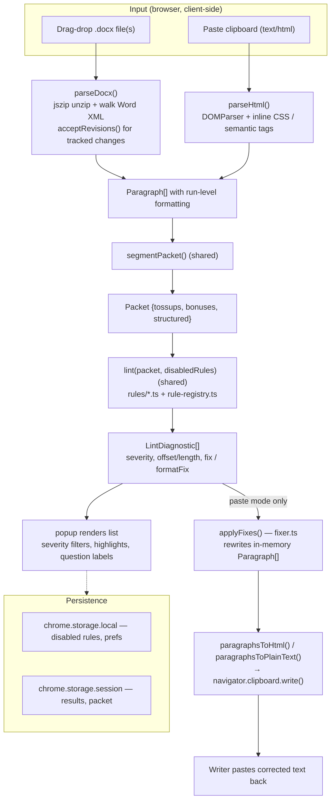
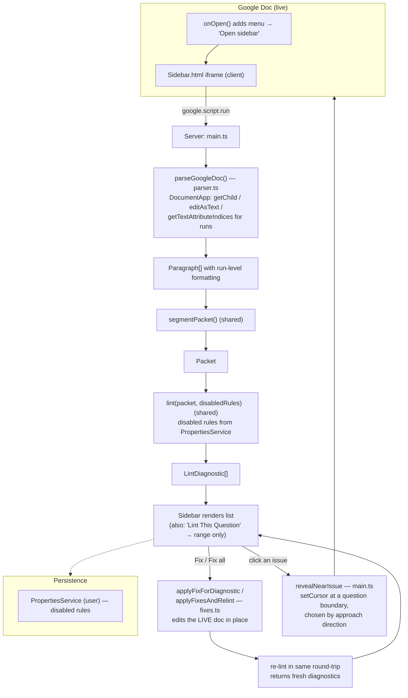

# qbcheck Architecture: Chrome Extension vs. Google Apps Script Add-on

qbcheck ships as **two front-ends over one linting core**. Both surfaces reuse the
same segmentation, rule engine, rules, and rule registry from `src/core/`. They
diverge only at the two ends of the pipeline:

- **Input / parsing** — how raw document text becomes `Paragraph[]`.
- **Output** — how fixes are applied and how issues are surfaced to the writer.

```
                 ┌──────────────────────── SHARED CORE (src/core) ────────────────────────┐
   INPUT  ─────► │  Segmenter → Engine (rules + registry) → Diagnostics[]                  │ ─────► OUTPUT
 (differs)       │  segmenter.ts   engine.ts   rules/*.ts   rule-registry.ts   model.ts    │       (differs)
                 └────────────────────────────────────────────────────────────────────────┘
        ▲                                                                                          ▲
        │                                                                                          │
  Parser differs:                                                                          Fixer / surfacing differs:
  parseDocx / parseHtml   ◄── Chrome                                    in-memory fixer + clipboard ──►
  parseGoogleDoc          ◄── Apps Script                           live-doc edits + jump-to-question ──►
```

---

## 1. At-a-glance comparison

| Dimension            | Chrome Extension                                        | Apps Script Add-on                                             |
| -------------------- | ------------------------------------------------------ | ------------------------------------------------------------- |
| **Runs where**       | Browser popup, fully client-side                       | Google servers (V8 runtime) + sidebar iframe in Google Docs   |
| **Language**         | TypeScript → bundled ES for the browser                | TypeScript → bundled ES, `export` stripped to GAS globals     |
| **Entry point**      | `src/popup/popup.html` + `popup.ts`                    | `src/apps-script/main.ts` (`onOpen`, `showSidebar`)           |
| **Input mechanism**  | Drag-drop `.docx` **or** paste clipboard HTML          | The **live** active Google Doc (no upload)                    |
| **Parser**           | `parseDocx` (jszip + Word XML) / `parseHtml` (DOMParser)| `parseGoogleDoc` (DocumentApp API)                            |
| **Segmenter**        | `src/core/segmenter.ts` (shared)                       | same                                                          |
| **Rule engine**      | `src/core/engine.ts` + `rules/*` (shared)              | same                                                          |
| **Autofix**          | In-memory `fixer.ts` → rewritten `Paragraph[]`         | In-place `fixes.ts` edits via `DocumentApp` (`text.insert/delete/setBold`) |
| **Fix delivery**     | Copy fixed rich HTML / plain text to clipboard         | Mutates the document directly, then re-lints                  |
| **Issue surfacing**  | Rendered list in popup (severity groups, highlights)   | Sidebar list; clicking an issue scrolls its question to the top of the doc |
| **Multi-packet**     | Yes — multiple `.docx`, cross-packet category rule     | No — one open document                                        |
| **State/settings**   | `chrome.storage.local` / `.session`                    | `PropertiesService.getUserProperties()`                       |
| **Build**            | `vite build` → `dist/` (root `src/popup`)              | `vite build` (lib) → `apps-script/Code.js` + `Sidebar.html`   |
| **Distribution**     | Load `dist/` unpacked (or Web Store), MV3 manifest     | `clasp push` to a bound/standalone Apps Script project        |
| **Permissions**      | `storage`, `clipboardRead`                             | OAuth: `documents.currentonly`, `script.container.ui`         |
| **`.qblintignore`**  | N/A (CLI uses it; extension does not)                  | N/A (disabled rules via UserProperties instead)              |

---

## 2. Chrome extension pipeline



**Notes**

- The extension never touches the network — everything runs in the popup.
- **Autofix is paste-mode only** (`isPasteMode`): file-mode results are read-only,
  because there is nowhere to write a `.docx` back to. In paste mode the fixer
  produces a corrected `Paragraph[]`, converted to rich HTML + plain text and
  copied to the clipboard for the writer to paste over their original.
- Multiple `.docx` files can be loaded at once, which enables the cross-packet
  `tag.consistent-categories` rule.

---

## 3. Apps Script add-on pipeline



**Notes**

- Input is the **already-open document** — no upload/parse-from-file step. The
  parser reads structure via the `DocumentApp` API rather than raw XML.
- Two lint modes: **whole packet** (`runLint`) and **current question only**
  (`lintCurrentQuestion`, which detects the cursor's question and shifts
  diagnostic paragraph indices back to absolute document positions).
- **Fixes mutate the document directly.** `applyFixesAndRelint` applies every fix
  and re-lints in a **single** `google.script.run` round-trip to keep the
  displayed list accurate without a second server call.
- **Clicking an issue frames its question** (`revealNearIssue`, one round-trip).
  It reads the cursor and, based on approach direction, `setCursor`s a question
  boundary so the whole question reads from the top of the viewport: from below,
  it aims at the issue's own question start (lands at the top edge); from above,
  it aims at the next question start (lands at the bottom edge, and since a
  question is ~a screenful the issue's question start ends up near the top). No
  text highlight — the sidebar snippet points at the exact span. The sidebar
  can't scroll the editor itself (cross-origin iframe over a canvas-rendered
  doc), so every jump is a server round-trip; a warm-up ping on list hover hides
  cold starts.

---

## 4. Stage-by-stage divergence

| Stage             | Chrome                                             | Apps Script                                             | Shared? |
| ----------------- | ------------------------------------------------- | ------------------------------------------------------ | ------- |
| **1. Input**      | Local `.docx` upload or clipboard HTML paste      | The live active Google Doc                             | ❌      |
| **2. Parse**      | `parseDocx` / `parseHtml` → `Paragraph[]`         | `parseGoogleDoc` → `Paragraph[]`                       | ❌ (same output type) |
| **3. Segment**    | `segmentPacket()`                                 | `segmentPacket()`                                      | ✅      |
| **4. Rules**      | `lint()` + `rules/*` + `rule-registry`            | `lint()` + `rules/*` + `rule-registry`                 | ✅      |
| **5. Fix**        | `fixer.ts` — in-memory rewrite of `Paragraph[]`   | `fixes.ts` — in-place `DocumentApp` edits              | ❌      |
| **6. Surface**    | Popup list + clipboard copy of fixed text         | Sidebar list + direct edits + click-to-jump            | ❌      |

The key architectural insight: **`Paragraph[]` and `LintDiagnostic[]` are the two
contract types that let one core serve two hosts.** Each host writes its own
adapter on either side of that contract — a parser that produces `Paragraph[]`,
and a fixer/surfacer that consumes `LintDiagnostic[]`.

---

## 5. Build & distribution

### Chrome extension

```
src/popup/*  +  src/core/*  ──(vite build, root=src/popup)──►  dist/
                                                                 ├── popup.html / popup.js / popup.css
                                                                 ├── manifest.json  (copied)
                                                                 └── icons/         (copied)
```

- `npm run build` → `tsc && vite build`.
- Distributed as a **Manifest V3** unpacked extension: `chrome://extensions` →
  Developer mode → Load `dist/` (or packaged for the Chrome Web Store).
- Purely client-side; no background service worker, no host permissions.

### Apps Script add-on

```
src/apps-script/main.ts (entry) + src/core/*  ──(vite lib build)──►  apps-script/Code.js
                                                    │  post-step: strip `export`, remove export block
                                                    │             (GAS needs top-level function globals)
src/apps-script/sidebar.html  ──(copy)──►  apps-script/Sidebar.html
```

- `npm run build:apps-script` → `tsc --noEmit -p src/apps-script/tsconfig.json && vite build --config vite.config.apps-script.ts`.
- `npm run push:apps-script` → build then `clasp push -f` to the Apps Script
  project (`.clasp.json`, see `.clasp.json.example`).
- `jszip` is marked **external** — the Apps Script bundle relies on `DocumentApp`,
  not the docx/HTML parsers, so the zip dependency is never pulled in.

---

## 6. Testing

Both surfaces share the core's rule tests (`test/rules/*`, `test/*.test.ts`).
The Apps Script adapters are tested in isolation with a **fake GAS harness**
(`test/apps-script/fake-gas.ts`) that stubs `DocumentApp`, `Logger`, and
`PropertiesService`, so parser, segment-shifting, fixes, and jump-to-issue
navigation can run under Vitest without a real Google Doc.
